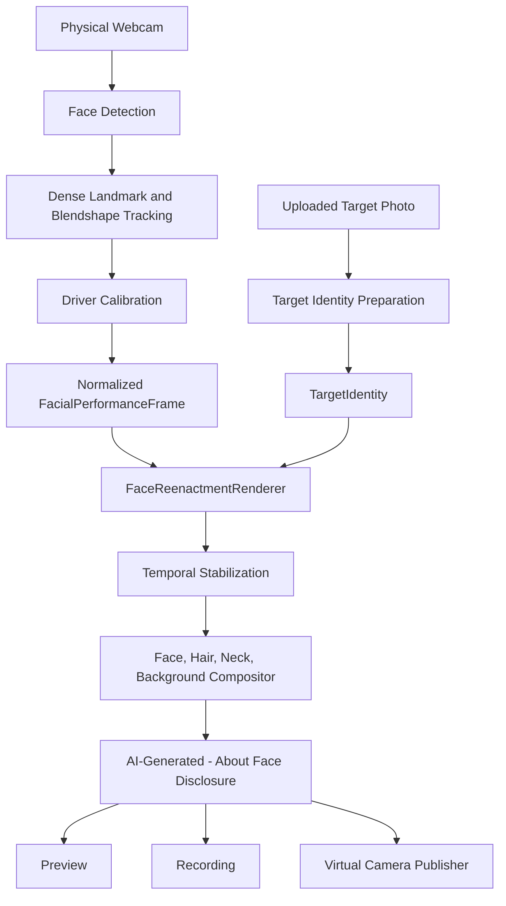

# Target Architecture

## Implemented Today

- Physical webcam capture.
- MediaPipe Face Landmarker tracking.
- Dense landmarks.
- Blendshape mapping to `FacialPerformanceFrame`.
- Basic upload and target mesh preparation.
- Fast Preview canvas renderer.
- Visible disclosure watermark.
- Preview and recording.
- Android native launch path using Kotlin, Compose, and CameraX Preview/ImageAnalysis.
- Android keep-latest frame strategy with reliable `ImageProxy` closing.
- Android thermal, battery, camera-active, streaming-active, recording-active, and performance-mode indicators.
- Android desktop-streaming policy scaffolding with short-lived non-persistent pairing tokens.

## Prototype Quality

- Driver calibration UI exists but does not yet compute a full baseline profile.
- Smoothing is not yet region-specific in the live loop.
- Target identity preparation does not yet include masks, depth, canonical pose, or embeddings.
- Mesh preview still renders in `main.tsx`.
- Android native path currently tracks CameraX frame flow but does not yet run native MediaPipe Face Landmarker inference.
- Android recording, Sharesheet, MediaProjection, and WebRTC paths are product scaffolds, not completed media pipelines.

## Not Yet Implemented

- Neural renderer.
- 3D renderer.
- Local inference service.
- Dedicated compositor.
- Frame transport.
- Desktop app.
- Windows virtual camera.
- macOS camera extension.
- Android systemwide virtual-camera replacement. This is intentionally unsupported by normal Android app APIs.
