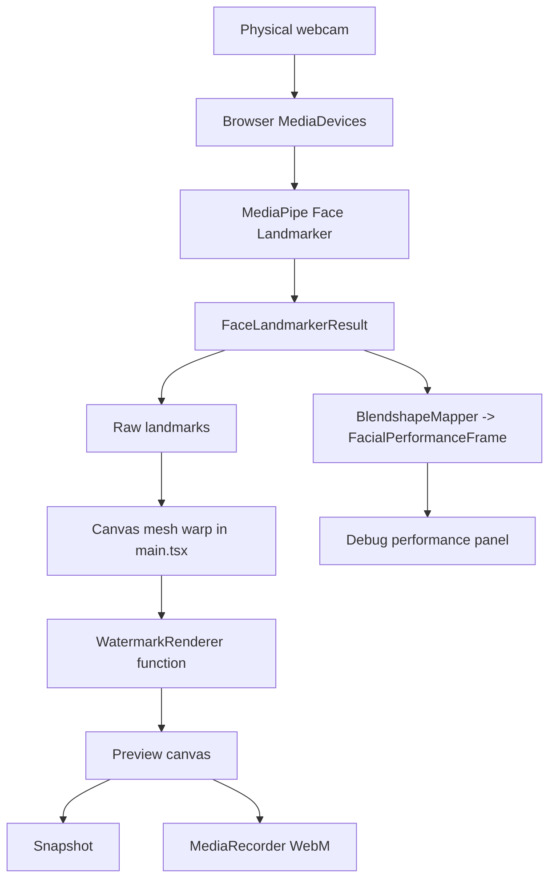

# About Face Repository Audit

Audit date: 2026-07-11

Repository: https://github.com/kingcorey1221/Aboutface1.0

Local checkout: `C:\Users\kingc\Desktop\apps\About Face`

## Current Stack

- Frontend framework: React 19 with TypeScript.
- Desktop framework: none. The current app is browser-only.
- Build system: Vite 6 with `tsc` production type checking.
- Test system: Vitest with jsdom.
- Face detection and tracking: MediaPipe Face Landmarker via `@mediapipe/tasks-vision`.
- Local model assets: `public/mediapipe/models/face_landmarker.task` and local wasm files.
- Rendering method: Canvas 2D.
- Target image representation: uploaded image is analyzed with MediaPipe landmarks, triangulated with Delaunator, then used as a 2D triangulated texture.
- Current renderer category: `mesh-preview`, not neural and not true 3D.
- Recording: browser `canvas.captureStream(30)` plus `MediaRecorder`, where supported.
- Virtual camera: not implemented.
- Inference location: browser only. No backend or native process.
- Privacy/consent controls: upload consent toggles, local consent/session audit records, local deletion control, visible watermark.

## Current File Structure

- `src/main.tsx`: application shell, camera lifecycle, MediaPipe setup, upload flow, canvas mesh rendering, recording controls, metrics display.
- `src/types.ts`: shared app, performance, renderer, and target identity types.
- `src/tracking/BlendshapeMapper.ts`: maps MediaPipe blendshape categories into normalized facial-performance frames.
- `src/tracking/FaceTracker.ts`: current tracker configuration boundary.
- `src/rendering/FaceRenderer.ts`: shared renderer contract exports.
- `src/rendering/MeshPreviewRenderer.ts`: typed fallback renderer adapter contract. The live canvas implementation still resides in `main.tsx`.
- `src/target/TargetFaceModel.ts`: target face model boundary types.
- `src/services/*`: image validation, consent/session storage, recording metadata, secure storage status, report logging.

## Current Pipeline

```text
Physical webcam
  -> MediaDevices stream
  -> MediaPipe Face Landmarker
  -> dense landmarks + blendshapes
  -> FacialPerformanceFrame mapping
  -> global smoothing control
  -> target landmark transform
  -> Delaunator triangle texture warp
  -> face oval mask + edge feather
  -> eye/mouth cutouts
  -> live lighting overlay
  -> watermark
  -> canvas preview / snapshot / recording
```

## Current Architecture Diagram



## Coupling Findings

- Tracking and rendering are still coupled in `src/main.tsx`.
- The renderer still depends on raw live landmarks for geometry. It does not yet render from `FacialPerformanceFrame` alone.
- `FacialPerformanceFrame` is available for the future renderer path, but the mesh renderer has not fully migrated to it.
- Target enrollment is basic: face detection, landmarks, triangulation, and file validation. It does not generate masks, depth, canonical pose, or identity embeddings.
- Smoothing is still mostly global in the UI. Region-specific smoothing types now exist but are not fully wired into the live loop.

## Runtime Validation

Commands run:

```bash
npm run test
npm run build
```

Result before this audit update: both passed.

Current live FPS and end-to-end latency require a real webcam session and were not measured in headless automation. The app displays measured FPS, MediaPipe inference time, render time, dropped frames, and browser heap when available; it does not display GPU utilization, VRAM, queue depth, or virtual-camera latency.

## Current Tests

- `src/services/imageValidation.test.ts`
- `src/services/consentLog.test.ts`
- `src/services/recording.test.ts`
- `src/tracking/BlendshapeMapper.test.ts`

Coverage is focused on pure services and tracking mapping. There are no long-running 60-second camera integration tests yet.

## Realism Ceiling

The current renderer cannot produce a realistic reenacted face from one image because it only warps visible pixels from the target photo. It cannot synthesize:

- inner mouth
- teeth
- eyelid surfaces
- hidden cheek/jaw geometry
- side-view head detail
- temporally stable neural texture
- hair/neck/background segmentation
- occlusion-aware replacement

The current renderer must remain a Fast Preview fallback.
